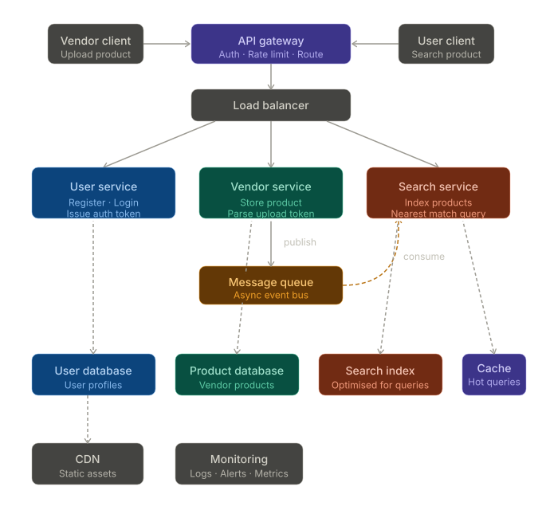

    # Product Search System — High Level Design

A scalable architecture for a product upload and search platform built around three independent services, designed to handle millions of requests.

---



---
## Overview

The system allows vendors to upload products and users to search for them with accurate, nearest-match results. Product data flows asynchronously from the vendor service into a search index, keeping uploads fast and search reliable at scale.

---

## Architecture

```
Vendor client                          User client
     |                                      |
     └──────────────┬───────────────────────┘
                    ▼
              API gateway
          Auth · Rate limit · Route
                    |
              Load balancer
          ┌─────────┼──────────┐
          ▼         ▼          ▼
    User service  Vendor    Search
                  service   service
                    |    ──────────▶ (consume)
                    ▼
              Message queue
                (publish)
```

---

## Services

### User service
- Handles user registration and login
- Issues auth tokens used across all services
- Reads and writes to the **user database**

### Vendor service
- Accepts product uploads from vendors
- Parses and validates the upload token
- Stores products in the **product database**
- Publishes a message to the **message queue** after every successful upload

### Search service
- Consumes messages from the queue asynchronously
- Indexes incoming products into the **search index**
- Serves nearest-match search queries to users
- Uses a **cache** to serve repeated or popular queries without hitting the index

---

## Data Flow

### Product upload flow

```
1. Vendor sends product  →  API gateway  →  Vendor service
2. Vendor service saves product  →  Product database
3. Vendor service publishes event  →  Message queue
4. Search service consumes event  →  Search index updated
```

### User search flow

```
1. User sends query  →  API gateway  →  Search service
2. Search service checks Cache
   ├── HIT  →  return result immediately
   └── MISS →  query Search index  →  return result  →  store in Cache
```

---

## Components

| Component | Role |
|---|---|
| API gateway | Single entry point. Implemented as Nginx (`gateway/nginx.conf`) — routes `/user/`, `/vendor/`, `/search/` prefixes to the respective services |
| Load balancer | Distributes traffic across service instances |
| User service | Registration, login, token issuance |
| Vendor service | Product upload, token parsing, storage |
| Search service | Product indexing and nearest-match query |
| Message queue | Async event bus between vendor and search service |
| User database | Stores user profiles |
| Product database | Stores vendor product data |
| Search index | Optimised storage for fast search queries |
| Cache | Stores hot/frequent query results |
| CDN | Serves static assets like product images |
| Monitoring | Logs, alerts, and metrics across all services |

---

## Scalability Design

### Horizontal scaling
Each service is stateless and sits behind its own load balancer. Any service can be scaled independently based on load — if search traffic spikes, only the search service scales up.

### Async product indexing
The vendor service does not write directly to the search index. It publishes to a message queue and returns a fast response to the vendor. The search service indexes in the background. This decouples the two services and prevents upload latency from growing with search index size.

### Caching
Frequently searched queries are stored in the cache layer. This reduces load on the search index and keeps response times low for popular searches.

### Rate limiting at the gateway
The API gateway enforces rate limits before requests reach any service. This protects all downstream services from traffic bursts and abuse.

---

## Key Design Decisions

**Why a message queue between vendor and search?**
Direct synchronous writes to the search index on every upload would couple the two services tightly. If the search index is slow or down, uploads would fail. The queue makes them independent — uploads always succeed and indexing catches up.

**Why a separate search index?**
The product database is optimised for writes and structured queries. Search requires a different access pattern — fuzzy matching, ranking, and nearest-neighbour lookup. A dedicated search index serves this without degrading product database performance.

**Why a cache in front of search?**
User search patterns tend to repeat. A cache with a short TTL significantly reduces the number of index queries, especially during high-traffic periods.

---

## Folder Structure (suggested)

```
/
├── user-service/
├── vendor-service/
├── search-service/
├── api-gateway/
├── docs/
│   └── hld.md
└── README.md
```

---

## Getting Started

All services and the gateway are wired together in `docker-compose.yml`. Bring the full stack up with:

```bash
docker compose up --build
```

The stack starts in dependency order: postgres + redis + rabbitmq → Go services → nginx gateway. The gateway is the only externally exposed port (`80`). Route prefix mapping:

| Public prefix | Service |
|---|---|
| `/user/...` | user-service |
| `/vendor/...` | vendor-service |
| `/search/...` | search-service |

For CDN and monitoring, deploy those separately and point CDN origins at the gateway hostname.

---

## Contributing

Each service owns its own codebase, database, and deployment. Changes to one service should not require changes to another. Communication between services happens only through the API gateway or the message queue.